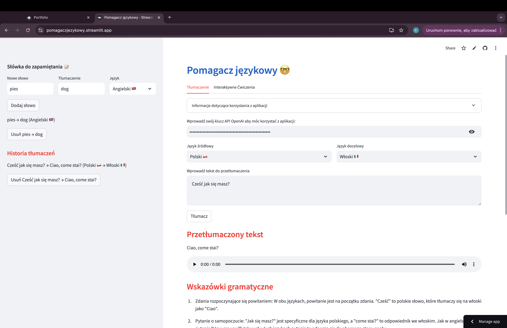
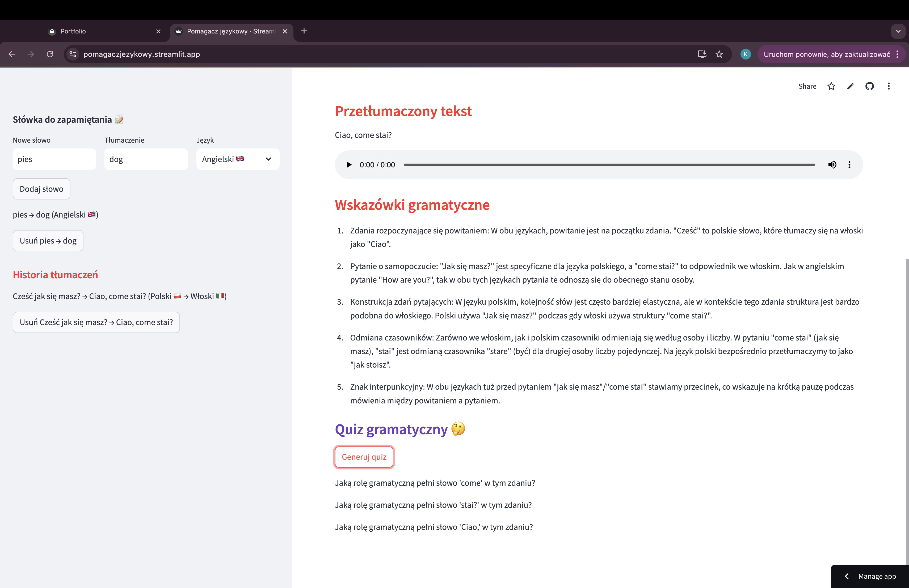
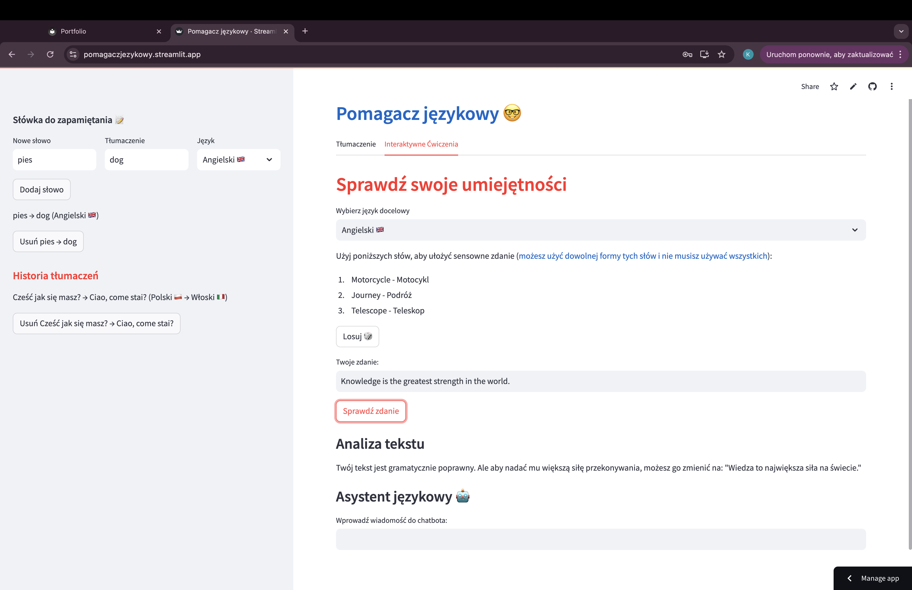

A oto moja pierwsza aplikacja którą napisałem od zera po dwóch misiącach nauki. Jestem z niej bardzo dumny bo nie tylko spełniła wszystkie założenia, ale też otworzyła mnie na nowe rzeczy związane z programowaniem oraz AI. Chociaż mogłoby się wydawać, że o niej zapomniałem to wcale tak nie jest bo mam zamiar dalej ją rozwijać i z moją obecną wiedzą zrobić super aplikacje do nauki języków obcych w której każdy się połapie. Na ten moment jest bardzo prosta bo wszystko zapisuje lokalnie nie ma wielu interaktywnych ćwiczeń, ale na tamten moment nie dysponowałem taką wiedzą jak teraz i w tym momencie wiem jak chcę żeby ta apka wyglądała. W wolnych chwilach mam zamiar ją rozwijać tak żeby była elegancka i w pełni gotowa do wypuszczenia na rynek, bo kto wie może postanowie ją wypromować i zebrać pierwszych prawdziwych klientów i urodzi się z tego coś dużego. Fajnie by było, żeby ludzie mogli uczyć się z pasji czy z powodu przeprowadzki w przystępnej cenie 😉.

(link do repozytorium)[https://github.com/Kacper-77/Pomagacz_jezykowy]

(link do aplikacji)[https://pomagaczjezykowy.streamlit.app/]

Poniżej kilka ujęć mojej aplikacji ⬇

