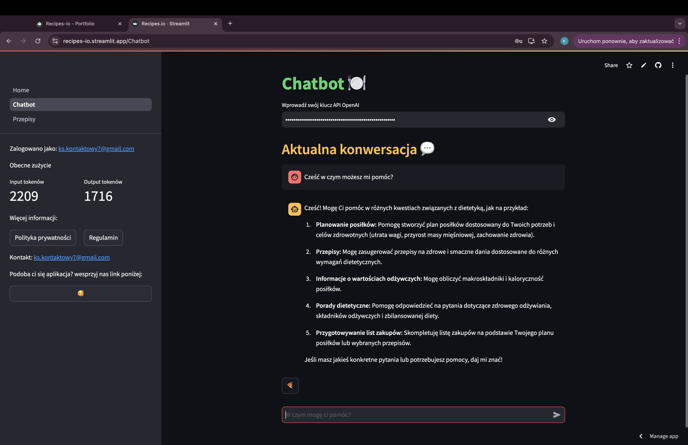

Oto jedna z moich aplikacji jest ona prosta w założeniach, ale bardzo wiele się nauczyłem podczas jej tworzenia. Między innymi jak dodawać autentyfikacje Google, jak zarządzać użytkownikami, nauczyłem się wiele o zależnościach dotyczących baz danych, nauczyłem się również jak wyceniać (orientacyjnie) i wiele więcej, ale nie starczyło by dnia żeby wszystko opisać. No dobrze po tym przydługawym wstępie może w końcu powiem o co chodzi w tej aplikacji, a jest to mianowicie narzędzie skierowane do każdej z osób bez wyjątku, bo przecież każdy z nas musi jeść. No właśnie jest to swego rodzaju asystent do spraw żywieniowych nie tylko da użytkownikom porady odnośnie żywienia, ale poda przepis czy nawet całą diete. Wystarczy opisać co dokładnie chcemy, jakie mamy składniki czy na coś chorujemy albo możemy poprosić o coś tematycznego np. pomysł na deser z okazji imprezy halloween, wtedy klikamy enter i boom... dzieje się magia. zostaną wtedy rozpisane wszystkie składniki, makro i sposób przyrządzenia.

[link do aplikacji](https://recipes-io.streamlit.app/)

[link do repozytorium](https://github.com/Kacper-77/Recipes_io)

Poniżej można znaleźć kilka przykładowych screenów ⬇

